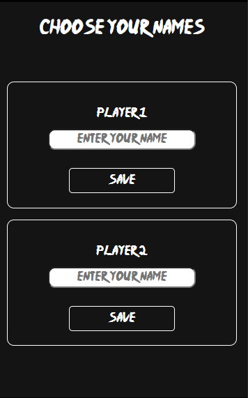

# TIC TAC TOE 

## CONTENIDO
   
* Introducción
* Requisitos
* Tecnologías utilizadas
* Posibles problemas
* Autores
* Licencias

### INTRODUCCIÓN

Este proyecto requería la creación de un sitio web responsive de un famoso juego llamado Tic Tac Toe o Tres en Raya. Estructurado en ventanas diferentes que a continuación paso a explicar.

* Se ha estructurado de la siguiente manera:
    - Pantalla de bienvenida al jugador con botón de acceso a selección de jugadores y normas del juego:
    
   
    - Pantalla de selección del nombre de ambos jugadores e iniciación del juego.
    
    
    
    
    - Pantalla principal del juego, con su tablero y la información de cada jugador correspondiente.
    
    
    
    - Pantalla del ganador, donde al resultar una combinación ganadora en el juego, se mostrará esta con un mensaje de enhorabuena.

    
    

### REQUISITOS

* Un dispotivo, como por ejemplo: móvil, tablet, ordenador..
* Un navegador (Google Chrome, Mozilla Firefox, Opera...)

### TECNOLOGÍAS UTILIZADAS

* Este proyecto se ha realizado utlizando:
    - VsCode: como editor de texto
    - Google Chrome: para la comprobación del funcionamiento utilizando las herramientas de desarrollador
    - HTML5
    - CSS3
    - BOOTSTRAP 5
    - JAVASCRIPT
    - GITHUB para el control de versiones y guardado del proyecto
    - Markdown filter para la elaboración del Readme

### POSIBLES PROBLEMAS

En la versión actual del proyecto no se han encontrado posibles problemas.
Si existe algún problema, o usted como usuario detecta alguno, póngase en contacto con el autor de este. Lo encontrará en la sección de autoría más abajo.

### AUTORES

Autores actuales:

* Jordi Jericó López 

### LICENCIAS

* MIT License
* Copyright (c) 2023 Jordi Jerico
